# Knowledge Portal

Tree-structured knowledge portal over flat chat conversations.

## Architecture



Mermaid source: [`docs/architecture.mmd`](docs/architecture.mmd)

- `core/` — Pure logic (no UI/persistence deps), consumable by any client.
- `server/` — Express API server.
- `web/public/` — Web UI (one of potentially many UIs).
- `ingestion/` + `scripts/` — Import Telegram messages into the DB.

## Navigation Rules (Default Strategy)

| Action | Effect |
|---|---|
| Send without reply | Append to current layer |
| Reply to other's message | Branch into new sub-layer |
| Reply to own message | Jump back to that layer, append |

Navigation strategy is pluggable — swap `DefaultNavigationStrategy` with your own.

## Quick Start

```bash
npm install
cp .env.example .env
npm run dev
```

Open http://localhost:3001

## Ingestion Options

### A) Bot polling (limited visibility in groups)
```bash
npm run poll
```

### B) User-account MTProto sync (recommended; sees human + bot messages)
```bash
npm run mtproto:once   # first login + one sync
npm run mtproto:loop   # continuous sync
npm run mtproto:reset-last-id -- 560   # optional: move checkpoint backward/forward
```

`PORTAL_VIEWER_USER_ID` controls whose perspective is treated as "self".
`PORTAL_BOT_USER_IDS` (comma-separated Telegram user ids) marks bot senders; bot replies stay in the same layer as the ask they reply to.
`TG_REPLAY_BUFFER` (default `30`) re-pulls a small recent message-id window on every MTProto sync so edited bot messages can be refreshed by upsert.

## API

- `POST /api/messages` — add a message `{ id, sender, replyToId?, content, timestamp? }`
- `GET /api/layers/:id` — get layer by id
- `GET /api/tree` — get full tree structure
- `GET /api/current` — get current layer
- `GET /api/state` — export state
- `POST /api/state` — import state
- `POST /api/reset` — reset to empty

## Test

```bash
npm test
```
