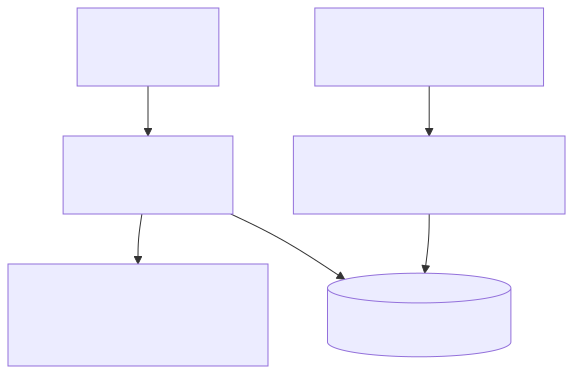

# Knowledge Portal

Tree-structured knowledge portal over flat chat conversations.

## Architecture



Mermaid source: [`docs/architecture.mmd`](docs/architecture.mmd)

- `core/` — Pure logic (no UI/persistence deps), consumable by any client.
- `server/` — Express API server.
- `web/public/` — Web UI (one of potentially many UIs).
- `ingestion/` + `scripts/` — Import Telegram messages into the DB.

## Navigation Rules (Default Strategy)

| Action | Effect |
|---|---|
| Send without reply | Append to current layer |
| Reply to other's message | Branch into new sub-layer |
| Reply to own message | Jump back to that layer, append |

Navigation strategy is pluggable — swap `DefaultNavigationStrategy` with your own.

## Quick Start

```bash
npm install
cp .env.example .env
npm run app:watch
```

Open http://localhost:3002

If you also want MTProto ingestion running locally:

```bash
npm run dev:all
```

## Ingestion Options

### A) User-account MTProto sync (recommended; sees human + bot messages)
```bash
npm run mtproto:once   # first login + one sync
npm run mtproto:loop   # continuous sync
npm run mtproto:reset-last-id -- 560   # optional: move checkpoint backward/forward
```

### B) MTProto session init only (no DB sync)
Use this when you just want to initialize/update Telegram login session.

```bash
npm run mtproto:login
```

### C) Debug utility: fetch one raw Telegram message payload
Use this to inspect the exact MTProto payload for a specific message id (helpful for adapter/topic logic).

```bash
node scripts/fetch-telegram-msg.js -1003826585913 1623
```

### D) Claude Code and Codex session sync
Use these to ingest local code-agent sessions as KP topics grouped by project.

```bash
npm run claude:sync
npm run codex:sync
```

Claude reads `~/.claude/projects`; Codex reads `~/.codex/sessions` and `~/.codex/session_index.jsonl`.
For remote mirrors, use `CLAUDE_SOURCES` or `CODEX_SOURCES` with the matching sync script.

### E) Debug utility: inspect stored messages in SQLite
Use this to verify whether a Telegram message id exists in KP storage and inspect its row.

For the local dev app, messages are typically stored in `data/dev.db`.

Search by full normalized id:

```bash
sqlite3 data/dev.db "SELECT id, source, channel, sender_id, reply_to_id, timestamp, substr(content,1,200) AS preview FROM messages WHERE id = 'tg:-1003826585913:1623';"
```

Search by Telegram numeric message id suffix:

```bash
sqlite3 data/dev.db "SELECT id, source, channel, sender_id, reply_to_id, timestamp, substr(content,1,200) AS preview FROM messages WHERE id LIKE 'tg:%:1623' ORDER BY timestamp DESC;"
```

Inspect full raw metadata for one row:

```bash
sqlite3 data/dev.db "SELECT id, raw_meta FROM messages WHERE id = 'tg:-1003826585913:1623';"
```

### F) Debug utility: test Telegram sendText from CLI
Sends a real Telegram message using `TelegramSender`.

```bash
node scripts/test-send-text.js <chatId> "<text>" [replyToId]

# examples
node scripts/test-send-text.js -1003826585913 "hello from CLI"
node scripts/test-send-text.js -1003826585913 "reply test" 1623
```

If `replyToId` is omitted, the message is sent as a plain non-reply message.

It reads credentials/session from:
- `TG_API_ID` / `TG_API_HASH` (or `TELEGRAM_API_ID` / `TELEGRAM_API_HASH`)
- `TG_SESSION_PATH` (or fallback `data/telegram_user.session`)
- optional default chat from `TG_CHAT_ID`

`PORTAL_VIEWER_USER_ID` controls whose perspective is treated as "self".
`PORTAL_BOT_USER_IDS` (comma-separated Telegram user ids) marks bot senders; bot replies stay in the same layer as the ask they reply to.
`TG_REPLAY_BUFFER` (default `30`) re-pulls a small recent message-id window on every MTProto sync so edited bot messages can be refreshed by upsert.

## API

- `POST /api/messages` — add a message `{ id, sender, replyToId?, content, timestamp? }`
- `GET /api/current` — get current layer
- `GET /api/state` — export state
- `POST /api/state` — import state
- `POST /api/reset` — reset to empty
- `POST /api/telegram/send` — send Telegram text `{ chatId?, text, replyToId? }` (`chatId` falls back to `TG_CHAT_ID`/primary Telegram chat); blocked when target topic is marked deleted
- `POST /api/telegram/topics/create` — create Telegram forum topic `{ chatId?, title }` (returns `topicUUID`)
- `POST /api/topics/:topicUUID/archive` — hide topic from sidebar (`archived=true`)
- `POST /api/topics/:topicUUID/delete` — delete topic on Telegram and mark `deleted_at` (history kept in KP)

## Test

```bash
npm test
```
